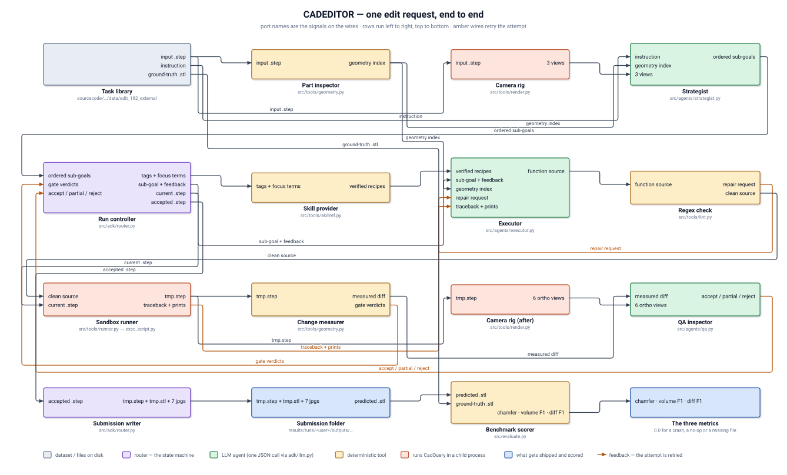
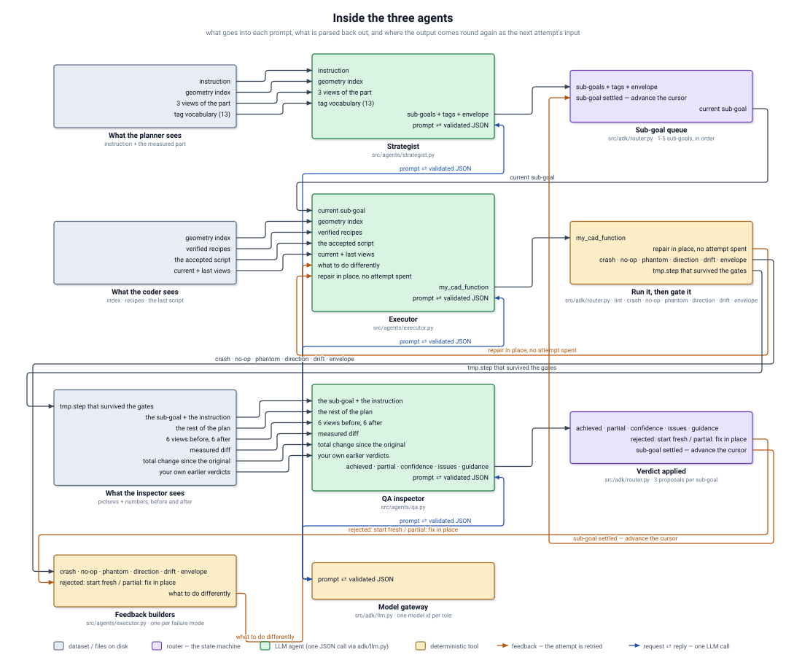
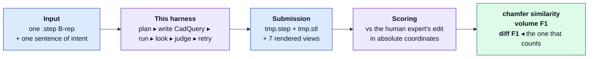
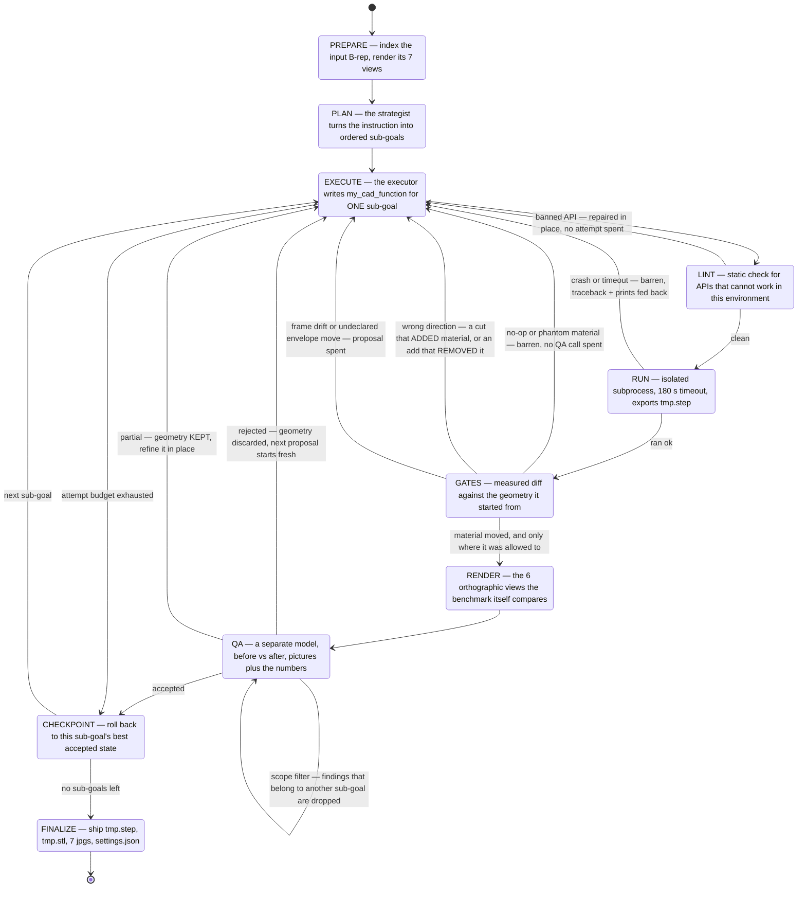
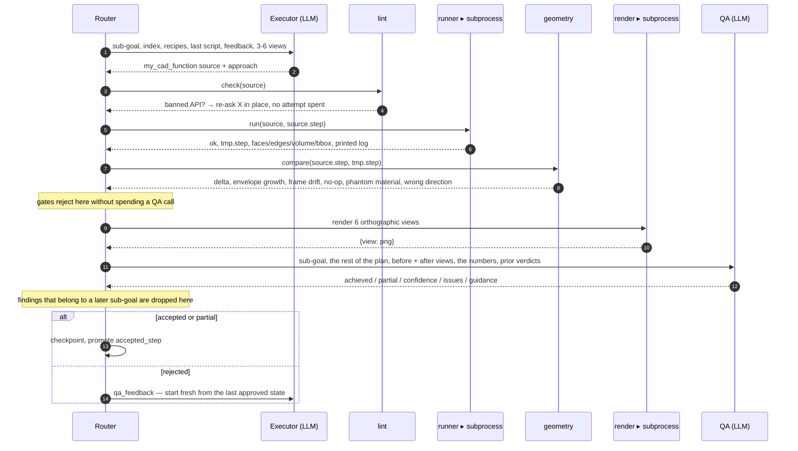

<!-- blockdiagram: body=df647f462f22 generated=2026-08-20 00:17 UTC -->
# Architecture — CADEDITOR
> **Generated file — do not edit by hand.** Regenerate with `python3 tools/blockdiagram.py` after any change to the code; a hook does it automatically when Claude edits a file.
Source commit: `5e01a8c` + uncommitted changes
**What this project is.** An agentic harness for the IDETC 2026 Autodesk *neuralCAD-Edit* benchmark. It is given one CAD part as a STEP file and one sentence describing an edit, and it must produce the edited part. It is scored against the edit a human expert made from the same instruction — and the metric that matters, **diff F1**, compares *your change* to *their change*, so a no-op and a from-scratch rebuild both score near zero.
**How to read this file.** The diagrams are Mermaid — they render on GitHub and in most Markdown viewers, and the source below each fence is readable as plain text if yours does not. Section 6 is the per-module I/O contract; sections 8 and 9 are generated live from the source, so if they disagree with the prose, trust them and regenerate.

---

## 1 · The schematic — one edit request, end to end
Every block shows its named ports: inputs on the left edge, outputs on the right, and each wire is labelled with the signal it carries. Amber wires are feedback — they send the attempt back to be retried. Rows run left to right, top to bottom.



<sub>Generated by [`tools/blockdiagram.py`](tools/blockdiagram.py) — open [docs/architecture.svg](docs/architecture.svg) on its own for a full-size view.</sub>

The same thing in plain text, for a terminal:
```
  request_id
      │
      ▼
 ┌──────────────┐   instruction + input .step
 │  benchmark   │──────────────────────────────┐
 │  DB (mongita)│                              │
 └──────────────┘                              ▼
                                    ┌─────────────────────┐
                                    │  geometry.inspect   │  opaque 266-face solid
                                    │  (B-rep index)      │  ──► hole families, cylinders,
                                    └─────────┬───────────┘      planar faces, bbox
                                              │ index text
                                              ▼
 ┌───────────────────────────────────────────────────────────────────────────┐
 │                        StatefulRouter  (adk/router.py)                     │
 │                                                                            │
 │   STRATEGIST ──► ordered sub-goals  [goal, tags, envelope]                  │
 │        │                                                                   │
 │        ▼   for each sub-goal, up to 3 judged proposals                      │
 │   ┌──────────────────────────────────────────────────────────────────┐     │
 │   │ EXECUTOR ─► my_cad_function ─► lint ─► subprocess run ─► compare  │     │
 │   │      ▲                                                    │       │     │
 │   │      │              gates: crash · no-op · phantom         │       │     │
 │   │      │            direction · frame drift · envelope       ▼       │     │
 │   │      │                                            render 6 views   │     │
 │   │      │                                                    │       │     │
 │   │      └──── feedback ◄──── QA verdict ◄─── accept/partial/reject    │     │
 │   └──────────────────────────────────────────────────────────────────┘     │
 │                                                                            │
 │   accepted geometry only ──► checkpoint ──► revert to best ──► next sub-goal│
 └───────────────────────────────────────────────────────────────────────────┘
                                              │
                                              ▼
                        finalize: tmp.step + tmp.stl + 7 jpgs + settings.json
                                              │
                                              ▼
                        evaluate: chamfer similarity · volume F1 · diff F1
```

### Every wire in that schematic

| from | signal | to |
|---|---|---|
| `Task library` | **input .step** | `Part inspector` |
| `Task library` | **input .step** | `Camera rig` |
| `Task library` | **instruction** | `Strategist` |
| `Part inspector` | **geometry index** | `Strategist` |
| `Camera rig` | **3 views** | `Strategist` |
| `Strategist` | **ordered sub-goals** | `Run controller` |
| `Run controller` | **tags + focus terms** | `Skill provider` |
| `Skill provider` | **verified recipes** | `Executor` |
| `Run controller` | **sub-goal + feedback** | `Executor` |
| `Part inspector` | **geometry index** | `Executor` |
| `Executor` | **function source** | `Regex check` |
| `Regex check` | ↺ **repair request** | `Executor` |
| `Regex check` | **clean source** | `Sandbox runner` |
| `Run controller` | **current .step** | `Sandbox runner` |
| `Sandbox runner` | **tmp.step** | `Change measurer` |
| `Sandbox runner` | **tmp.step** | `Camera rig (after)` |
| `Sandbox runner` | ↺ **traceback + prints** | `Executor` |
| `Change measurer` | **measured diff** | `QA inspector` |
| `Camera rig (after)` | **6 ortho views** | `QA inspector` |
| `Change measurer` | ↺ **gate verdicts** | `Run controller` |
| `QA inspector` | ↺ **accept / partial / reject** | `Run controller` |
| `Run controller` | **accepted .step** | `Submission writer` |
| `Submission writer` | **tmp.step + tmp.stl + 7 jpgs** | `Submission folder` |
| `Submission folder` | **predicted .stl** | `Benchmark scorer` |
| `Benchmark scorer` | **chamfer · volume F1 · diff F1** | `The three metrics` |
| `Task library` | **ground-truth .stl** | `Benchmark scorer` |

`↺` marks a feedback wire — it sends the attempt back to be retried.

---

## 2 · Inside the three agents
The schematic above draws each agent as one block, which hides the thing that actually decides whether a run scores: **what goes into each prompt, what is parsed back out of it, and which of those outputs come round again as the next attempt's input**. Same conventions — named ports, labelled wires, amber for feedback — with the shared JSON client drawn once at the bottom.



<sub>Open [docs/agents.svg](docs/agents.svg) on its own for a full-size view.</sub>

**The three loops, and what bounds each one.**

| Loop | Trigger | Bound | What changes on the way round |
|---|---|---|---|
| **JSON retry** | the reply did not parse | 3 tries, inside one call | the parse error is appended and the model is asked again — the baseline degrades to `{}` here and burns a whole iteration |
| **lint repair** | the source calls an API that cannot work here | 2 repairs, **no attempt spent** | the executor is re-asked in place with the exact remedy and its own source; a typo is not a design decision |
| **attempt** | a gate or QA rejected the result | 3 judged proposals per sub-goal, plus barren attempts that produced nothing to judge | the feedback text — a traceback, a no-op diagnosis, an envelope violation, or QA's issues — and on the last proposal the executor switches to *last resort* mode |
| **sub-goal** | the sub-goal settled or ran out of attempts | the plan's length, 1-5 | the router rolls back to the best checkpoint, re-indexes the geometry from the accepted state, and advances |

**Every wire in the agent schematic**

| from | signal | to |
|---|---|---|
| `What the planner sees` | **instruction** | `Strategist` |
| `What the planner sees` | **geometry index** | `Strategist` |
| `What the planner sees` | **3 views of the part** | `Strategist` |
| `What the planner sees` | **tag vocabulary (13)** | `Strategist` |
| `Strategist` | **sub-goals + tags + envelope** | `Sub-goal queue` |
| `Strategist` | ⇄ **prompt ⇄ validated JSON** | `Model gateway` |
| `Sub-goal queue` | **current sub-goal** | `Executor` |
| `What the coder sees` | **geometry index** | `Executor` |
| `What the coder sees` | **verified recipes** | `Executor` |
| `What the coder sees` | **the accepted script** | `Executor` |
| `What the coder sees` | **current + last views** | `Executor` |
| `Feedback builders` | ↺ **what to do differently** | `Executor` |
| `Executor` | **my_cad_function** | `Run it, then gate it` |
| `Executor` | ⇄ **prompt ⇄ validated JSON** | `Model gateway` |
| `Run it, then gate it` | ↺ **repair in place, no attempt spent** | `Executor` |
| `Run it, then gate it` | **crash · no-op · phantom · direction · drift · envelope** | `Feedback builders` |
| `Run it, then gate it` | **tmp.step that survived the gates** | `What the inspector sees` |
| `What the inspector sees` | **the sub-goal + the instruction** | `QA inspector` |
| `What the inspector sees` | **the rest of the plan** | `QA inspector` |
| `What the inspector sees` | **6 views before, 6 after** | `QA inspector` |
| `What the inspector sees` | **measured diff** | `QA inspector` |
| `What the inspector sees` | **total change since the original** | `QA inspector` |
| `What the inspector sees` | **your own earlier verdicts** | `QA inspector` |
| `QA inspector` | **achieved · partial · confidence · issues · guidance** | `Verdict applied` |
| `QA inspector` | ⇄ **prompt ⇄ validated JSON** | `Model gateway` |
| `Verdict applied` | ↺ **rejected: start fresh / partial: fix in place** | `Feedback builders` |
| `Verdict applied` | ↺ **sub-goal settled — advance the cursor** | `Sub-goal queue` |

---

## 3 · Context — what goes in, what comes out


| | |
|---|---|
| **Input** | `request.brep_start` → a `.step` B-rep with no feature history, plus the instruction text (e.g. *"Add 0.2 mm chamfer to the hole edges to improve fitting"*) |
| **Output** | `tmp.step`, `tmp.stl`, seven `.jpg` views and `settings.json`, in the exact folder layout the benchmark ingests |
| **Scored on** | the STL, voxelised in **absolute world coordinates with no alignment** — a correct part in the wrong position scores near zero |
| **Never seen** | the ground-truth edit |

---

## 4 · Block diagram — every module, its inputs and its outputs
Solid arrows are control flow, dotted arrows are data, thick arrows cross a process boundary. Each block shows its top input and output ports; the full contract is in section 6.

```mermaid
flowchart TB
  subgraph entry_g["Entry points"]
    direction TB
    pipeline["<b>pipeline.run_request</b><br/><i>in ▸</i> request_id, user_id…<br/><i>out ▸</i> SessionState, output dir &lt;edit_id&gt;/brep_end/&lt;ts&gt;/…"]
    evaluate["<b>evaluate.score_output</b><br/><i>in ▸</i> request_id, output dir holding tmp.stl…<br/><i>out ▸</i> chamfer_similarity_norm, volume_f1…"]
    dashboard["<b>tools/dashboard.py</b><br/><i>in ▸</i> request_id picked in the UI, run button…<br/><i>out ▸</i> interactive 3D meshes, per-attempt gallery of the seven QA views…"]
    dashviz["<b>tools/dashviz.py</b><br/><i>in ▸</i> plain lists and dicts of scores, costs and labels<br/><i>out ▸</i> Plotly figures, the categorical palette and status colours"]
    run_headless["<b>tools/run_headless.py</b><br/><i>in ▸</i> request ids, --todo N (tasks with no run record yet)…<br/><i>out ▸</i> the same results/dashboard_runs/&lt;request_id&gt;.json record the UI reads, progress + final scores on stdout"]
    browse["<b>tools/browse.py</b><br/><i>in ▸</i> --list, request id…<br/><i>out ▸</i> instruction text, topology summary…"]
  end
  subgraph orch_g["Orchestration (ADK)"]
    direction TB
    state["<b>adk.state.SessionState</b><br/><i>in ▸</i> request_id, instruction…<br/><i>out ▸</i> subtasks[], geometry_text…"]
    router["<b>adk.router.StatefulRouter</b><br/><i>in ▸</i> SessionState, on_event callback<br/><i>out ▸</i> accepted_step per sub-goal, checkpoints…"]
    llm["<b>adk.llm.LLM</b><br/><i>in ▸</i> system prompt, content parts (text + base64 images)…<br/><i>out ▸</i> parsed dict, Usage: tokens, calls, cost estimate"]
  end
  subgraph agent_g["LLM agents"]
    direction TB
    strategist["<b>agents.strategist.plan</b><br/><i>in ▸</i> instruction, geometry index text…<br/><i>out ▸</i> understanding, subtasks: goal, rationale, focus, tags, envelope"]
    executor["<b>agents.executor.build</b><br/><i>in ▸</i> sub-goal + tags, geometry index…<br/><i>out ▸</i> Python function source, approach sentence…"]
    qa["<b>agents.qa.review</b><br/><i>in ▸</i> sub-goal + customer instruction, the rest of the plan, labelled done / not run yet…<br/><i>out ▸</i> achieved, partial…"]
  end
  subgraph tool_g["Tool layer (deterministic)"]
    direction TB
    geometry["<b>tools.geometry</b><br/><i>in ▸</i> STEP path, before/after STEP pair<br/><i>out ▸</i> inspect(): hole families, cylinders, planar faces, BLIND/THROUGH per opening, bores and ports as paired mouths, to_prompt(): compact index text…"]
    skillref["<b>tools.skillref</b><br/><i>in ▸</i> instruction, sub-goal…<br/><i>out ▸</i> recipe text, section ids…"]
    focus["<b>tools.focus</b><br/><i>in ▸</i> instruction, sub-goal…<br/><i>out ▸</i> topics, sizes (mm, plus angles in degrees)…"]
    lint["<b>tools.lint</b><br/><i>in ▸</i> generated function source<br/><i>out ▸</i> [(rule, precise remedy)], repair feedback text"]
    runner["<b>tools.runner.run_script</b><br/><i>in ▸</i> function source, input STEP…<br/><i>out ▸</i> ok, info: step path, faces, edges, volume, bbox…"]
    exec_script["<b>tools.exec_script</b><br/><i>in ▸</i> --function_file, --input_file…<br/><i>out ▸</i> tmp.step, RESULT: (json) line on stdout…"]
    render["<b>tools.render</b><br/><i>in ▸</i> STEP path, view list…<br/><i>out ▸</i> (view: png), tmp.stl"]
    render_proc["<b>tools.render_proc</b><br/><i>in ▸</i> --step, --views…<br/><i>out ▸</i> PNG per view, STL…"]
    config["<b>config</b><br/><i>in ▸</i> .env, environment variables<br/><i>out ▸</i> model ids per role, loop budgets…"]
  end
  subgraph external_g["External systems"]
    direction TB
    api["<b>OpenAI-compatible API</b><br/><i>in ▸</i> chat.completions with json_object response format<br/><i>out ▸</i> JSON replies, usage counters"]
    cadquery["<b>CadQuery / OCC kernel</b><br/><i>in ▸</i> STEP, generated Python<br/><i>out ▸</i> edited solid, STEP…"]
    dataset["<b>dataset + mongita DB</b><br/><i>in ▸</i> request_id<br/><i>out ▸</i> instruction text, input .step…"]
    metrics["<b>benchmark metric code</b><br/><i>in ▸</i> ground-truth STL, predicted STL…<br/><i>out ▸</i> chamfer similarity (norm), volume F1…"]
    skillfile["<b>Skills/reference/recipes_edit.md</b><br/><i>in ▸</i> section ids selected by tag and keyword<br/><i>out ▸</i> recipe text within RECIPES_MAX_TOKENS"]
  end

    dataset -.->|"instruction + input STEP"| pipeline
    pipeline -.->|"new SessionState"| state
    pipeline -->|"run()"| router
    dashboard -->|"run_request on a thread"| pipeline
    dashboard -->|"score_output"| evaluate
    dashviz -.->|"Plotly figures + design tokens"| dashboard
    dataset -.->|"records + renders"| browse
    run_headless -->|"_run_pipeline(rid, user) on a worker thread"| dashboard
    router -->|"inspect the input, re-index after each accept"| geometry
    router -->|"render the before views"| render
    router -->|"plan(state)"| strategist
    router -->|"build(sub-goal, feedback)"| executor
    router -->|"check(script) before running it"| lint
    router -->|"run_script(script, source STEP)"| runner
    router -->|"compare(before, after) -&gt; gates"| geometry
    router -->|"review(before views, after views, diff)"| qa
    router -.->|"checkpoint / revert to best"| state
    router -->|"finalize: 7 views + tmp.stl"| render
    strategist -->|"json(system, parts)"| llm
    executor -->|"json(system, parts)"| llm
    qa -->|"json(system, parts)"| llm
    llm -->|"chat.completions"| api
    strategist -.->|"tags_help()"| skillref
    executor -->|"recipes_for(tags, focus)"| skillref
    skillref -.->|"extract_cues() — topics, sizes, directions"| focus
    skillref -.->|"load + score sections"| skillfile
    runner ==>|"subprocess"| exec_script
    render ==>|"subprocess"| render_proc
    exec_script -->|"exec the generated edit"| cadquery
    render_proc -->|"render_to_png + STL export"| cadquery
    geometry -.->|"topology + measurement"| cadquery
    router -.->|"submission folder"| evaluate
    dataset -.->|"ground-truth STL"| evaluate
    evaluate -->|"evals_diff + evals_feature_geometric"| metrics
    config -.->|"budgets, view lists, model ids"| router

  classDef entry fill:#dbeafe,stroke:#1e40af,stroke-width:1px,color:#0b1220;
  classDef orch fill:#ede9fe,stroke:#5b21b6,stroke-width:1px,color:#0b1220;
  classDef agent fill:#dcfce7,stroke:#166534,stroke-width:1px,color:#0b1220;
  classDef tool fill:#fef3c7,stroke:#92400e,stroke-width:1px,color:#0b1220;
  classDef external fill:#e5e7eb,stroke:#374151,stroke-width:1px,color:#0b1220;
  class pipeline,evaluate,dashboard,dashviz,run_headless,browse entry;
  class state,router,llm orch;
  class strategist,executor,qa agent;
  class geometry,skillref,focus,lint,runner,exec_script,render,render_proc,config tool;
  class api,cadquery,dataset,metrics,skillfile external;
```


---

## 5 · Control flow — the router state machine
This is the part that differs most from a standard "loop N times" harness. Control depends on state: attempts are budgeted per sub-goal, a crash and a QA rejection produce different feedback, several cheap deterministic gates reject an attempt *before* spending a QA call, and the geometry that gets promoted is the last one that **passed QA** — never simply whatever ran last.


**The two budgets.** A sub-goal gets `MAX_ATTEMPTS_PER_SUBTASK` *design proposals* — attempts that produced geometry somebody could judge. Attempts that produced nothing to look at (a traceback, a no-op, a selector that matched zero entities) are counted separately as *barren*, so a typo cannot retire a sub-goal that never once put a proposal in front of QA.

**The gates, in the order they fire** — each one rejects without an LLM call:

| Gate | Fires when | Why it exists |
|---|---|---|
| `lint` | the source names an API that cannot work here | repaired in place, no attempt spent |
| `crash` | the subprocess raised or timed out | traceback + the script's own prints go back to the executor |
| `no-op` | output is geometrically identical to the input | scores exactly zero; costs a QA call to discover otherwise. A no-op whose cause was a nonexistent API name swallowed by the script's own `try/except` is charged as a typo, not as a design signal, so it does not flip the sub-goal into *last resort* mode |
| `phantom-material` | summed volume rose but occupied space did not | a duplicate body hidden inside existing material — invisible in every render |
| `direction` | a sub-goal tagged `cut-hole-slot` ADDED material, or one tagged `add-body` REMOVED it | the only gate that asks whether the attempt did the right KIND of thing; never applied to fillet/chamfer, whose sign belongs to the edge and not the operation, and never to a sub-goal carrying both tags. After a kept partial the question is re-asked against the state the sub-goal *started* from, so trimming an oversized addition is not vetoed |
| `frame-drift` | the part was translated, rescaled or re-centred | views are auto-framed, so QA cannot see it; every metric scores it near zero |
| `envelope` | a bbox face moved that the sub-goal never declared | material on the wrong side of its reference face |
| `QA` | the model judges it against the sub-goal | three outcomes: accepted / partial (kept and refined) / rejected (discarded) |
| `QA scope filter` | a QA finding's distinctive words come from a sub-goal that has not run yet | QA is shown the rest of the plan so it can tell *not done* from *not this step's job*; this is the deterministic backstop, applied before the verdict reaches the executor or is written into the goal. A partial whose every issue was out of scope is promoted to a full acceptance |

---

## 6 · One attempt, in order


---

## 7 · Block reference — I/O contract per module

### Entry points

#### `pipeline.run_request`
[`src/pipeline.py`](src/pipeline.py) · 336 lines · `89193ce8`

Runs one benchmark request end to end: load it, drive the router, write the submission.

| | |
|---|---|
| **in** | `request_id` · `user_id` · `on_event callback` · `benchmark DB (mongita)` |
| **out** | `SessionState` · `output dir <edit_id>/brep_end/<ts>/` · `settings.json` |
| **public API** | `load_request(request_id, db)`, `task_index(request_id, db)`, `run_request(request_id, user_id, on_event, keep_work)`, `main()` |

> Keeps the work dir when anything failed, and copies every crashed script out for inspection. It also decides whether the dataset's own colour renders travel with the request: they are attached only when the instruction contains a word the synthetic index cannot answer — an appearance word, a view word, a deictic "that", or a dimension word ("taller", "wider", "thicker"), since which of three extents is the tall one is exactly what a bounding box does not know.

#### `evaluate.score_output`
[`src/evaluate.py`](src/evaluate.py) · 212 lines · `9b1e0727`

Scores a produced folder with the benchmark's own metric code, so numbers are comparable to the published baselines.

| | |
|---|---|
| **in** | `request_id` · `output dir holding tmp.stl` · `ground-truth STL from the DB` |
| **out** | `chamfer_similarity_norm` · `volume_f1` · `diff_f1` · `results/scores/<user>.json` |
| **public API** | `score_output(request_id, out_dir, db)`, `score_run(user_id, write)` |

> A missing STL scores 0.0 on all three metrics — exactly how the benchmark treats a failed edit.

#### `tools/dashboard.py`
[`tools/dashboard.py`](tools/dashboard.py) · 3967 lines · `640dc2ce`

Five-tab Dash UI: the method, the task, ground truth vs any baseline, a live run of our harness, and the results.

| | |
|---|---|
| **in** | `request_id picked in the UI` · `run button` · `docs/method_overview.md + docs/method_nodes.json` · `results/dashboard_runs/*.json` · `results/scores/ours_adk-router.json` · `the dataset's own all_results.json` |
| **out** | `interactive 3D meshes` · `per-attempt gallery of the seven QA views` · `per-task and benchmark-wide charts` · `a clickable pipeline diagram` |
| **public API** | `logo_src(path)`, `role_of(edit)`, `score_for(request_id, user, metric)`, `geom_path(brep_id, ext)`, `published_methods()`, `method_label(user)`, `our_runs()`, `sweep_scores()`, `latest_source(rid)`, `our_score(rid, metric)`, `our_task_ids()`, `our_cost(rid)`, `load_mesh(stl_path, max_tris)`, `mesh_figure(stl_path, color, title, height, max_tris)`, `surface_deviation(pred_stl, gt_stl, mtimes, max_tris)`, `deviation_figure(pred_stl, gt_stl, height)`, `our_views(brep_id)`, `img_tag(brep_id, view, width)`, `file_label(brep_id)`, `card(children, **style)`, `code_block(text, **style)`, `eyebrow(text, **style)`, `note(text, **style)`, `kpi(label, value, sub, color, width)`, `pill(text, color, filled, **style)`, `graph(fig, **style)`, `grid(children, min_width, gap)`, `task_options()`, `toggle_task_picker(tab)`, `render_tab(tab, rid)`, `instruction_card(req, size)`, `viewer_panel(children, **style)`, `input_tab(req)`, `compare_tab(req)`, `render_compare(model, rid)`, `StopRequested`, `ours_tab(req)`, `img_from_path(path, label, width)`, `our_output_stl(dest)`, `redacted_views(views)`, `steps_gallery(steps, finished)`, `stl_body(rid, view)`, `render_stl_view(view, rid)`, `ours_body(rid, run)`, `start_run(n, rid)`, `stop_run(n, rid)`, `poll_run(_n, rid)`, `method_graph()`, `schematic(compact)`, `hotspot_style(kind_stroke, selected)`, `schematic_detail_node(sid)`, `node_detail(node_id)`, `mermaid_source()`, `best_model_baseline(rids)`, `human_ceiling(rids)`, `headline_numbers()`, `schematic_figure()`, `slide(n, title, sub, *body)`, `chip_row(items, colour)`, `budget_tiles()`, `kinds_row()`, `agents_figure()`, `method_tab()`, `where_we_stand(bare)`, `pick_node(_clicks)`, `flow_frames(rid)`, `animation_tab(rid)`, `flow_speed(ms)`, `flow_step(_tick, _play, _reset, scrub, _clicks, _close, state, rid)`, `method_colors()`, `results_tab(rid)`, `render_results(scope, rid)`, `sweep_dest(entry)`, `our_view_path(dest, view)`, `score_chips(scores, small)`, `method_panel(title, subtitle, colour, stl, iso_img, views, scores, emphasis, missing)`, `per_task_results(rid)`, `our_tokens(rid)`, `general_results()`, `results_table(rids, by_method, labels, diffs, at)`, `competition_tab()` |

> Runs the pipeline on a background thread — which is why all rendering shells out to a child process. Every score it shows is one run per task, the most recent: the per-task record and the sweep file are compared on the run timestamp inside the output path and the newer one wins outright, scores and geometry together, so a chart and the part beside it are never different runs.

#### `tools/dashviz.py`
[`tools/dashviz.py`](tools/dashviz.py) · 379 lines · `7e5183c3`

Chart factories and design tokens for the dashboard.

| | |
|---|---|
| **in** | `plain lists and dicts of scores, costs and labels` |
| **out** | `Plotly figures` · `the categorical palette and status colours` |
| **public API** | `score_color(v)`, `empty_fig(message, height)`, `ranked_bar(labels, values, colors, title, height, value_fmt, xtitle, horizontal)`, `grouped_metric_bar(entities, series, title, height, ytitle)`, `grouped_by_difficulty(difficulties, series, title, height, ytitle)`, `parity_scatter(points, title, height, xlabel, ylabel)`, `violin_group(rows, title, height, highlight, ytitle)`, `cost_density(points, title, height, xlabel, ylabel, xprefix)` |

> Imports neither Dash nor the benchmark, so it can be exercised on its own and cannot cycle back into the UI module. Series take palette slots in a fixed order because the order is what keeps adjacent pairs separable under colour-blind simulation; charts that put every pair on screen at once (the scatters) are held to three.

#### `tools/run_headless.py`
[`tools/run_headless.py`](tools/run_headless.py) · 132 lines · `36e9ca41`

Batch runner: the dashboard's Run button without the browser, one task after another.

| | |
|---|---|
| **in** | `request ids` · `--todo N (tasks with no run record yet)` · `--list` |
| **out** | `the same results/dashboard_runs/<request_id>.json record the UI reads` · `progress + final scores on stdout` |
| **public API** | `run_one(dash_mod, rid)`, `main()` |

> Calls `dashboard._run_pipeline` rather than reimplementing it, so a headless run and a clicked run leave identical records. The pipeline goes on a worker thread only so this process can tail its log lines to stdout while a 10-40 minute run is in flight.

#### `tools/browse.py`
[`tools/browse.py`](tools/browse.py) · 98 lines · `f1d92216`

CLI task browser: list the 48 requests, or open one task's renders.

| | |
|---|---|
| **in** | `--list` · `request id` · `--open` |
| **out** | `instruction text` · `topology summary` · `dataset JPGs` |
| **public API** | `geom(db, brep_id, ext)`, `topo(step_path)`, `main()` |

### Orchestration (ADK)

#### `adk.state.SessionState`
[`src/adk/state.py`](src/adk/state.py) · 98 lines · `83845f2d`

The shared, inspectable blackboard the router drives and every agent reads a slice of.

| | |
|---|---|
| **in** | `request_id` · `instruction` · `input_step` · `work_dir` |
| **out** | `subtasks[]` · `geometry_text` · `accepted_step` · `checkpoints[]` · `steps[] with renders` · `events[]` |
| **public API** | `SubTask`, `SessionState [log(self, kind, msg, **extra), current(self), done(self), progress(self), to_dict(self), save(self, path)]` |

> Explicit structured state, not a growing chat log — that is what keeps the context from ballooning across a run.

#### `adk.router.StatefulRouter`
[`src/adk/router.py`](src/adk/router.py) · 1633 lines · `3583e634`

The state machine: who runs next, how many attempts a sub-goal gets, which geometry gets promoted.

| | |
|---|---|
| **in** | `SessionState` · `on_event callback` |
| **out** | `accepted_step per sub-goal` · `checkpoints` · `finalized submission folder` |
| **public API** | `StatefulRouter [run(self), finalize(self, out_root, user_id)]` |

> Two budgets per sub-goal: design attempts (a real proposal was judged) and barren ones (a crash or a no-op). It also owns the two filters that keep one sub-goal's trouble out of another's: a no-op traced to a misspelled API name does not condemn the approach, and a QA finding whose vocabulary belongs to a pending sub-goal is dropped before it can be written into this sub-goal's text.

#### `adk.llm.LLM`
[`src/adk/llm.py`](src/adk/llm.py) · 230 lines · `c6b77df0`

OpenAI-compatible client with hard JSON guarantees and per-session token accounting.

| | |
|---|---|
| **in** | `system prompt` · `content parts (text + base64 images)` · `model id` |
| **out** | `parsed dict` · `Usage: tokens, calls, cost estimate` |
| **public API** | `Usage [add(self, resp, role), as_dict(self)]`, `image_part(path, detail)`, `text_part(text)`, `LLM [json(self, system, parts, retries)]` |

> A malformed reply is retried with the parse error fed back — the baseline degrades to {} and burns an iteration. One call is bounded at LLM_TIMEOUT_S (420 s) with 2 SDK retries, because the SDK's own 600 s default let a single stuck call take 57% of a run.

### LLM agents

#### `agents.strategist.plan`
[`src/agents/strategist.py`](src/agents/strategist.py) · 714 lines · `0e3109d6`

Turns one customer instruction into 1-5 ordered, checkable sub-goals.

| | |
|---|---|
| **in** | `instruction` · `geometry index text` · `tag vocabulary` · `3 views of the input part` |
| **out** | `understanding` · `subtasks: goal, rationale, focus, tags, envelope` |
| **public API** | `replan(state, sub, digest, usage)`, `plan(state, usage)` |

> `envelope` is the contract the router later enforces: which bbox faces this sub-goal may move. Its prompt is where the selection rules live: pick the instance by the PROPERTY the sentence uses (`[BLIND]` vs `[THROUGH]`, sweep angle, largest radius) rather than by position, prove a position is empty before putting a new feature there, and size an unstated dimension long enough to reach through the surface it serves, because a feature buried inside its host adds almost nothing to diff F1.

#### `agents.executor.build`
[`src/agents/executor.py`](src/agents/executor.py) · 1190 lines · `8ddeec1f`

Writes one CadQuery `my_cad_function` for exactly one sub-goal, and turns every failure mode into actionable feedback.

| | |
|---|---|
| **in** | `sub-goal + tags` · `geometry index` · `verified recipes` · `last accepted script` · `feedback from the last attempt` · `up to 6 view images` |
| **out** | `Python function source` · `approach sentence` · `feedback text for the next attempt` |
| **public API** | `build(state, feedback_text, usage, current_views, last_resort, tagged_views, color_plan)`, `io_summary(io)`, `io_dump(io)`, `failure_feedback(info, log, script)`, `noop_diagnosis(log)`, `noop_feedback(diff, log, script, topology_only)`, `envelope_feedback(diff, declared, undeclared)`, `one_shot(state, digest, usage, geometry_text)`, `qa_feedback(verdict, diff, kept, script, log)`, `frame_feedback(diff)` |

> Never sees the other sub-goals. `last_resort` mode swaps refinement for the bluntest thing that could work. Its prompt carries the list of API forms that do not exist in this build (cadquery 2.8.0 / OCP 7.9.3), and its feedback builders match a crash to the specific remedy for it — an empty `Bnd_Box` means the boolean produced nothing, "cannot find a solid on the stack" means the workplane was never seeded with the part.

#### `agents.qa.review`
[`src/agents/qa.py`](src/agents/qa.py) · 620 lines · `312b65a4`

The acceptance gate — a separate model that judges the edit against the sub-goal and can reject it.

| | |
|---|---|
| **in** | `sub-goal + customer instruction` · `the rest of the plan, labelled done / not run yet` · `6 ortho views before + after` · `measured diff` · `cumulative diff` · `its own earlier verdicts` |
| **out** | `achieved` · `partial` · `confidence` · `issues[]` · `plan_flaw` · `guidance` |
| **public API** | `plan_context(state)`, `review(state, before_views, after_views, diff, usage, cumulative, colored_after, change_plan, plan_ctx)` |

> Three outcomes, not two: partial keeps the geometry and refines it, rejection discards it. Completeness is judged against THIS sub-goal only — the other sub-goals are quoted in the prompt so that work which has not been reached yet is not read as work that is missing, and the router drops any finding that slips through anyway.

### Tool layer (deterministic)

#### `tools.geometry`
[`src/tools/geometry.py`](src/tools/geometry.py) · 2246 lines · `8c2c3076`

Turns an opaque B-rep into a queryable index, and two STEPs into a measured diff.

| | |
|---|---|
| **in** | `STEP path` · `before/after STEP pair` |
| **out** | `inspect(): hole families, cylinders, planar faces, BLIND/THROUGH per opening, bores and ports as paired mouths` · `to_prompt(): compact index text` · `compare(): faces/edges/volume delta, envelope growth, frame drift, no-op, phantom material, wrong direction` |
| **public API** | `load_shape(step_path)`, `summarize(step_path)`, `circular_edge_groups(step_path, top)`, `cylindrical_face_groups(step_path)`, `planar_faces(step_path, limit)`, `face_adjacency(step_path)`, `solid_interference(step_path, max_pairs)`, `solid_ownership(step_path, _shape)`, `pocket_depth_state(insp, step_path, _shape)`, `axial_features(groups, tol)`, `face_table(step_path, _shape, face_owner)`, `inspect(step_path, top_edges, top_faces)`, `to_prompt(insp)`, `color_plan(insp, max_groups)`, `is_noop(before_step, after_step, diff)`, `envelope_growth(a, b)`, `undeclared_envelope_moves(diff, declared)`, `frame_drift(a, b)`, `occupied_volume(step_path)`, `new_face_region(before_step, after_step, _shapes)`, `change_color_plan(prior_states, target_step)`, `per_solid_delta(sa, sb)`, `compare(before_step, after_step)`, `volume_direction_conflict(diff, tags)`, `envelope_text(diff)` |

> Selection by measured radius and position is what replaces guessing selector strings — and where the instruction selects by a PROPERTY ("that slot", "the end without a fillet"), the index states the property: every opening is labelled `[BLIND]` or `[THROUGH]` (a solid-classifier probe between the two mouths, so two pockets sunk from opposite faces are not read as one through-feature), and two coaxial rings of one radius are printed as the single bore or port they bound, with its length.

#### `tools.skillref`
[`src/tools/skillref.py`](src/tools/skillref.py) · 416 lines · `36891f26`

Selects the verified recipe sections for a sub-goal from the cadquery-editor skill, within a token budget.

| | |
|---|---|
| **in** | `instruction` · `sub-goal` · `focus terms` · `geometric tags` |
| **out** | `recipe text` · `section ids` · `tag vocabulary for the strategist prompt` |
| **public API** | `tags_help()`, `normalize_tags(tags)`, `load_sections(path)`, `score_sections(text, cues)`, `select(text, emphasis, budget, sections, tags)`, `recipes_for(instruction, *emphasis, budget, tags)` |

> A tag pins a section outright; keyword scoring fills the rest of the budget.

#### `tools.focus`
[`src/tools/focus.py`](src/tools/focus.py) · 165 lines · `8eae2d5e`

Deterministic cue extraction from text: which feature topics are named, which sizes are quoted and what each measures, which directions are mentioned.

| | |
|---|---|
| **in** | `instruction` · `sub-goal` · `strategist focus terms` |
| **out** | `topics` · `sizes (mm, plus angles in degrees)` · `directions` |
| **public API** | `compile_stems(stems)`, `extract_cues(text)` |

> Regex only, zero tokens, touches no B-rep. Its geometry-slicing half was removed: retrieval may decide which RECIPE to attach, never which geometry an agent is allowed to see.

#### `tools.lint`
[`src/tools/lint.py`](src/tools/lint.py) · 617 lines · `f9c4be2e`

Static check of the generated source for APIs that are certain to fail here, before a subprocess is spent.

| | |
|---|---|
| **in** | `generated function source` |
| **out** | `[(rule, precise remedy)]` · `repair feedback text` |
| **public API** | `check(script)`, `feedback(problems, script)` |

> A hit is repaired in place inside the same attempt — a banned-API typo is not a design decision. Two checks feed the same repair loop: a hand-written table of named traps, each harvested after it cost a run, and a generic one that parses the script and asks the INSTALLED cadquery/OCP whether an attribute really exists, offering the closest real name back. The generic half only reports a CALLED attribute on a name it typed with certainty (a constructor, or a chain of methods CadQuery annotates as returning their own type), skips anything dynamic, and is wrapped so introspection can never be the reason a good script is rejected. Whole-line comments are blanked before matching, after a correct script was rejected for a remark in its own comment.

#### `tools.runner.run_script`
[`src/tools/runner.py`](src/tools/runner.py) · 52 lines · `208fbcde`

Executes the generated function in an isolated subprocess with a timeout.

| | |
|---|---|
| **in** | `function source` · `input STEP` · `attempt dir` |
| **out** | `ok` · `info: step path, faces, edges, volume, bbox` · `trimmed stdout/stderr log` |
| **public API** | `run_script(function_src, input_step, out_dir, timeout)` |

#### `tools.exec_script`
[`src/tools/exec_script.py`](src/tools/exec_script.py) · 144 lines · `8cedf9b3`

The child process: exec the function, unwrap the return value, gate validity, export tmp.step.

| | |
|---|---|
| **in** | `--function_file` · `--input_file` · `--output_dir` |
| **out** | `tmp.step` · `RESULT: {json} line on stdout` · `the function's own prints` |
| **public API** | `run(function_src, input_file, output_dir)`, `main()` |

> Validity is judged relative to the input — 3 of the 48 inputs are already invalid B-reps.

#### `tools.render`
[`src/tools/render.py`](src/tools/render.py) · 215 lines · `79ea1e3f`

Renders the seven benchmark projections of a STEP, and exports the scored STL.

| | |
|---|---|
| **in** | `STEP path` · `view list` · `image size` |
| **out** | `{view: png}` · `tmp.stl` |
| **public API** | `render_views(step_path, out_dir, stem, views, size)`, `render_views_tagged(step_path, out_dir, insp, stem, views, size)`, `render_views_colored(step_path, out_dir, plan, stem, views, size)`, `export_stl(step_path, stl_path)`, `render_and_export(step_path, out_dir, stl_path, stem, views, size)`, `export_stl(step_path, stl_path, tolerance)`, `view_axis_table(views)` |

#### `tools.render_proc`
[`src/tools/render_proc.py`](src/tools/render_proc.py) · 228 lines · `eb21febe`

The child process that actually drives OCC's offscreen viewer.

| | |
|---|---|
| **in** | `--step` · `--views` · `--stl` |
| **out** | `PNG per view` · `STL` · `RENDER: {json} line` |
| **public API** | `main()` |

> Must not run on a background thread: OCC's macOS viewer needs a process main thread, and fails silently off it.

#### `config`
[`src/config.py`](src/config.py) · 156 lines · `4b2be8f5`

Every tunable in one place, overridable from src/.env.

| | |
|---|---|
| **in** | `.env` · `environment variables` |
| **out** | `model ids per role` · `loop budgets` · `view lists` · `paths` · `cost rates` |
| **public API** | `require_key()` |

### External systems

#### `OpenAI-compatible API`

Serves the three agent roles; one model id per role, so a cheaper QA model is a real cost lever.

| | |
|---|---|
| **in** | `chat.completions with json_object response format` |
| **out** | `JSON replies` · `usage counters` |

#### `CadQuery / OCC kernel`

Does the actual B-rep work: import STEP, edit, export STEP/STL, render projections.

| | |
|---|---|
| **in** | `STEP` · `generated Python` |
| **out** | `edited solid` · `STEP` · `STL` · `PNG views` |

> Refuses some edits Fusion performed happily — BRep_API: command not done on whole hole families at every size.

#### `dataset + mongita DB`

The 48 requests, the 237 STEP/STL parts and their renders, and the records that say which part is an input and which is an answer key.

| | |
|---|---|
| **in** | `request_id` |
| **out** | `instruction text` · `input .step` · `ground-truth .stl` |

> sourcecode/IDETC26-…/data/edit_192_external — CC BY-NC 4.0, not redistributed.

#### `benchmark metric code`

The repo's own evals, imported rather than reimplemented so our numbers are comparable to the published baselines.

| | |
|---|---|
| **in** | `ground-truth STL` · `predicted STL` · `start STL for diff F1` |
| **out** | `chamfer similarity (norm)` · `volume F1` · `diff F1` |

> src/utils/evals_diff.py + evals_feature_geometric.py in the submodule.

#### `Skills/reference/recipes_edit.md`

The verified CadQuery recipe book the executor is fed sections of.

| | |
|---|---|
| **in** | `section ids selected by tag and keyword` |
| **out** | `recipe text within RECIPES_MAX_TOKENS` |

---

## 8 · What a run leaves on disk
```
src/results/
└── runs/<user_id>/
    ├── _work/<request>_<ts>/            deleted after a clean run, kept on failure
    │   ├── views_input/input_<view>.png
    │   └── sub<N>_try<M>/
    │       ├── candidate_function.py    what the executor wrote
    │       ├── tmp.step                 what it produced
    │       └── views/out_<view>.png     what QA looked at
    └── outputs/<user_id>_<ts>/brep_end/<ts>/     ← the benchmark ingests this
        ├── settings.json                request id, tokens, cost, plan, provenance
        ├── tmp.step   tmp.stl           the STL is what gets scored
        ├── tmp_<view>.jpg               7 views: iso + 6 orthographic
        ├── session_state.json           the whole run, replayable
        └── steps/
            ├── sub<N>_try<M>_<verdict>.step   every attempt's geometry
            ├── sub<N>_try<M>_<verdict>.py     and the script that made it
            └── sub<N>_try<M>_<view>.jpg
```

---

## 9 · Tunable knobs
Parsed live from [`src/config.py`](src/config.py); override any of them in `src/.env`.

| Setting | Env var | Default | Notes |
|---|---|---|---|
| `REPO` | `NEURALCAD_REPO` | `''` | Find the benchmark repo root: honour NEURALCAD_REPO, else walk up from this file until a directory holding src/config/edit_192_external.json appears. Inside submissions/<team>/src  |
| `API_KEY` | `OPENAI_API_KEY` | `''` |  |
| `BASE_URL` | `OPENAI_BASE_URL` | `unset` |  |
| `MODEL_STRATEGIST` | `MODEL_STRATEGIST` | `'gpt-5.2-2025-12-11'` | One model per role — a cheap model for QA is a legitimate cost lever. |
| `MODEL_EXECUTOR` | `MODEL_EXECUTOR` | `'gpt-5.2-2025-12-11'` |  |
| `MODEL_QA` | `MODEL_QA` | `'gpt-5.2-2025-12-11'` |  |
| `REASONING_EFFORT` | `REASONING_EFFORT` | `'medium'` |  |
| `COST_IN` | `COST_PER_1M_INPUT` | `'1.75'` | $ per 1M tokens, for the cost estimate written into settings.json |
| `COST_OUT` | `COST_PER_1M_OUTPUT` | `'14.00'` |  |
| `MAX_SUBTASKS` | `MAX_SUBTASKS` | `'5'` | Loop budgets |
| `MAX_ATTEMPTS_PER_SUBTASK` | `MAX_ATTEMPTS_PER_SUBTASK` | `'3'` | Attempts that produced judgeable geometry — a real design decision that a gate or QA then rejected. |
| `MAX_BARREN_RETRIES` | `MAX_BARREN_RETRIES` | `'0'` | Extra headroom on top of that for attempts which produced nothing to judge (a traceback, a no-op). 0 means the ceiling equals the design budget: three attempts per sub-goal, total. |
| `MAX_REPLANS` | `MAX_REPLANS` | `'2'` | When EVERY attempt of a sub-goal is rejected and nothing was kept, the attempts' collected feedback goes back to the strategist for a new strategy and the sub-goal re-runs. This ca |
| `SCRIPT_TIMEOUT_S` | `SCRIPT_TIMEOUT_S` | `'180'` |  |
| `RENDER_SIZE` | `RENDER_SIZE` | `'512'` |  |
| `SELECTION_POLICY` | `SELECTION_POLICY` | `'mbr'` | How a sub-goal picks which of its kept checkpoints to ship. "rank" — verdict, then progress, then recency (the original behaviour) "mbr" — same, but ties are broken by geometric co |
| `LLM_TIMEOUT_S` | `LLM_TIMEOUT_S` | `'900'` | Wall clock for ONE model call. The SDK's own default is 600 s with silent retries on top, so a single stuck call can outlast everything else in the run put together: measured on ta |
| `LLM_MAX_RETRIES` | `LLM_MAX_RETRIES` | `'1'` | Retries inside the SDK, on top of the agent-level retries. Dropped from 2 to 1 for the same reason: past a 900 s ceiling a call is hung rather than slow, and a retried reasoning ca |
| `SKILLS_DIR` | `SKILLS_DIR` | `unset` | The cadquery-editor skill. Only `reference/recipes_edit.md` is ever sent to a model, and only the sections a given sub-goal needs. OFF by default for the recipes-ablation experimen |
| `RECIPES_MAX_TOKENS` | `RECIPES_MAX_TOKENS` | `'4100'` | 4100, not 4000, and the 100 is not a round number — it is the measured point at which §2 (localization) fits alongside the LARGEST tag section. §1 is always sent (799 t) and the he |
| `USE_SKILL_RECIPES` | `USE_SKILL_RECIPES` | `'0'` |  |
| `SHOW_EXECUTOR_VIEWS` | `SHOW_EXECUTOR_VIEWS` | `'1'` |  |

---

## 10 · Drift report
Checked on every regeneration: every block's file must exist, every arrow in section 3 must correspond to a symbol that really appears in the calling file, and every module in `src/`, `tools/` and `test/` must be claimed by a block.

**10 item(s) need attention** — the diagram above may be stale:

- **unmapped module** — `src/tools/mbr.py` exists but no block describes it
- **unmapped module** — `tools/build_site.py` exists but no block describes it
- **unmapped module** — `tools/export_handoff.py` exists but no block describes it
- **unmapped module** — `tools/export_prompts.py` exists but no block describes it
- **unmapped module** — `tools/make_site_data.py` exists but no block describes it
- **unmapped module** — `tools/make_web_meshes.py` exists but no block describes it
- **unmapped module** — `tools/mbr_backfill.py` exists but no block describes it
- **unmapped module** — `tools/mbr_offline.py` exists but no block describes it
- **unmapped module** — `tools/rebuild_candidates.py` exists but no block describes it
- **unmapped module** — `tools/selection_audit.py` exists but no block describes it

Fix by updating `BLOCKS` / `EDGES` in [`tools/blockdiagram.py`](tools/blockdiagram.py), then regenerating.

---

## 11 · Running it
```bash
# the dashboard — watch a run happen, step by step
./run_dashboard.sh                       # http://127.0.0.1:8050

# one request, headless
cd sourcecode/IDETC26-Hackathon-Autodesk-neuralCAD-Edit
PYTHONPATH=$(pwd):$(pwd)/../.. uv run python -m src.pipeline \
    --request <request_id> --score

# score everything produced so far
PYTHONPATH=$(pwd):$(pwd)/../.. uv run python -m src.evaluate \
    --user-id ours_adk-router

# regenerate this document
python3 tools/blockdiagram.py
```

Python **3.12 exactly**, via `uv`. An API key must be in `src/.env` (copy `.env.example`).
