# UCONN CAD PACK

Final submission for the ASME IDETC-CIE 2026 Hackathon (Autodesk neuralCAD-Edit benchmark).

We edit 3D CAD models from one-sentence customer instructions with a three-agent harness over CadQuery: a strategist plans, an executor writes code, deterministic gates reject bad geometry for free, and a QA agent verifies what survives. Everything in this folder is self-contained: the code, the dashboard, the output CAD files for all 48 tasks, the ground truth meshes, the scores, and the presentation.

**→ [kiarash99naghavi.github.io/UCONN-CAD-PACK](https://kiarash99naghavi.github.io/UCONN-CAD-PACK/)** — every task in the browser: the input part, our edit and the expert's edit as three live 3D views on one locked camera, plus every score and every write-up.

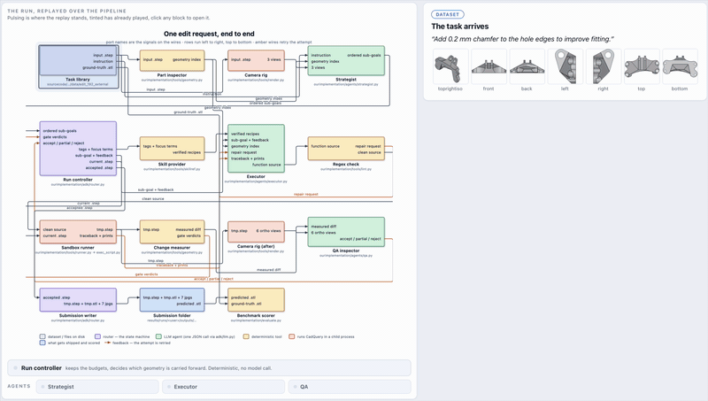

## Final scores

Computed with the benchmark's own metric code (`src/utils/evals_diff.py` and `src/utils/evals_feature_geometric.py`), same defaults as the published baselines, over all 48 edit tasks:

| Metric | Ours | Best published model baseline |
|---|---|---|
| Surface Chamfer similarity | **0.977** | 0.97 (gpt-5.2) |
| Volumetric F1 | **0.910** | 0.85 (gpt-5.2) |
| Volumetric Difference F1 (most important) | **0.390** | 0.18 (gpt-5.2) |

Mean cost per edit: $0.86. All 48 tasks produced valid edited geometry.

The full comparison chart is `figures/metric_bar_facets.png`, regenerated with our method added next to the published baselines (rebuild it any time with `scripts/make_metric_figure.py`).

Averaging all three metrics into one overall score puts us ahead of every published model baseline, with the human expert still on top (rebuild with `scripts/make_overall_mean_figure.py`):

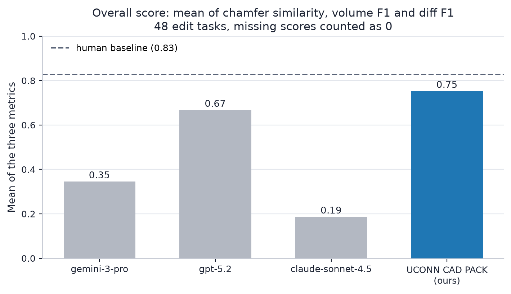

Per-request scores live in `src/results/scores/ours_adk-router.json` and in `outputs/manifest.json`.

## The framework


One request flows left to right: the geometry indexer and camera rig measure the input part, the strategist turns the instruction into 1 to 5 ordered sub-goals with envelopes, the executor writes one CadQuery function per sub-goal in a sandboxed subprocess, six deterministic gates reject bad geometry for free, the QA agent verifies what survives against seven views and the measured diff, and a stateful router re-indexes the part after every accepted step. Rejections loop back with specific feedback; when every attempt of a sub-goal dies, the strategist replans (at most twice).

The key ideas, in one paragraph each:

- **The strategist reads measurements, not pixels.** It gets a measured index of the part: hole families grouped by radius, every opening labelled blind or through, bores paired into single features, face areas. Colour renders are attached only when the instruction carries an appearance, view, deictic or dimension word. This is what lets it pick the right slot when the part has two congruent ones.

- **Gates reject before any model judges.** Six deterministic checks run on every attempt: real API names (the lint gate asks the installed CadQuery and OCP whether each attribute exists and repairs the nearest real name in place), no-op detection, phantom material buried inside the part, edit direction against the sub-goal's tag, frame drift, and the sub-goal's declared envelope. A rejection here costs zero tokens and returns specific text, not just a retry.

- **QA has no stake in the edit passing.** It is a separate model call that sees the sub-goal, the rest of the plan labelled done or not-run-yet, seven views before and after, and the measured diff. Three verdicts: accepted, partial (kept and refined in place), rejected (discarded).

- **Measurements decide, renders illustrate.** Every attempt is measured against the geometry it started from: volume delta, new-face regions, bounding box drift. A 5 mm gap on a 984 mm part is 2.5 pixels in a render; no image-based check can catch that, so the numbers gate first.

### Which model runs which agent

All three agents run the same model. One model per role is a deliberate config knob (a cheaper QA model is a legitimate cost lever), but every scored run in this repo used the defaults:

| Agent | Model | Reasoning effort |
|---|---|---|
| Strategist | `gpt-5.2-2025-12-11` | medium |
| Executor | `gpt-5.2-2025-12-11` | medium |
| QA | `gpt-5.2-2025-12-11` | medium |

The assignments live in `src/config.py` and can be overridden per role with the `MODEL_STRATEGIST`, `MODEL_EXECUTOR` and `MODEL_QA` environment variables (see `src/.env.example`). The gates use no model at all; they are deterministic geometry checks.

A longer write-up is in `docs/method_overview.md`, and the same content is rendered live on tab 1 of the dashboard.

## The five selected test examples

The five request_ids the organisers named for qualitative evaluation, shown as input part, our edit, and the human expert's edit (ground truth). Scores are chamfer / volume F1 / diff F1. The same five are on one slide in the presentation and on tab 7 of the dashboard.

| Task | Input | Ours | Ground truth | Scores |
|---|---|---|---|---|
| **1. [medium]** Please convert the round edges of the gear into straight spur gear teeth.<br>`SUJ2G2UMJQR7PMBX_1759209987.785593` | 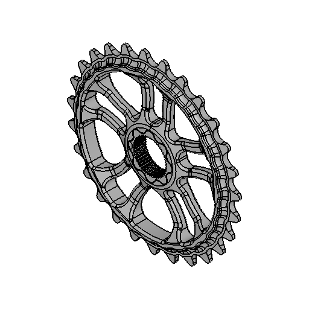 | 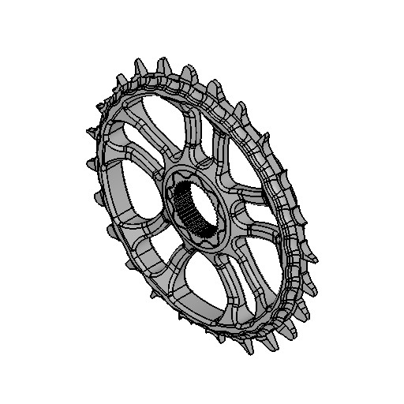 |  | 0.991 / 0.972 / 0.131 |
| **2. [medium]** Add cylindrical heads on the long pins to prevent link arms against slipping off.<br>`3YH2WFSRM22W7DKT_1769773335.525203` | 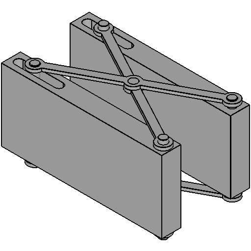 |  | 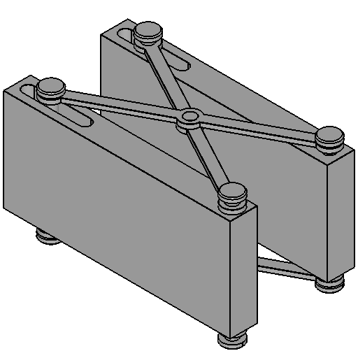 | 0.985 / 0.994 / 0.579 |
| **3. [easy]** Prolong black lever sticking out to the front by 5cm for better manipulation.<br>`B7A2N74ZJBF9MZHU_1770174133.012106` | 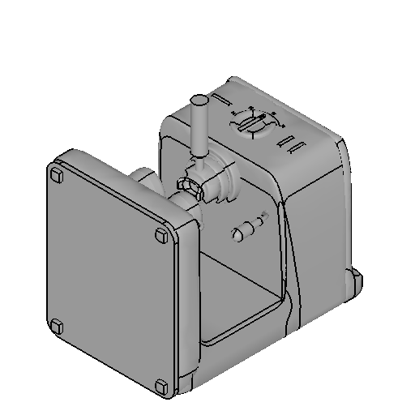 |  | 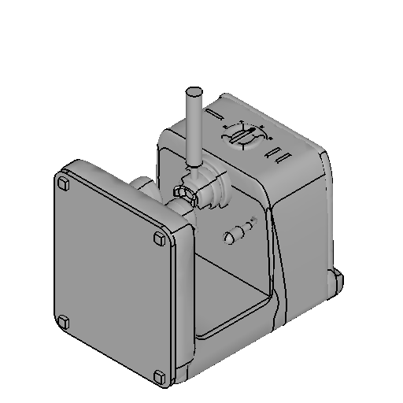 | 0.985 / 1.000 / 0.797 |
| **4. [hard]** Add third rotor blade to the assembly, same design as the other two, radii on all four long edges, thinner central portion.<br>`F332D3FXML85WLR2_1769607142.566352` | 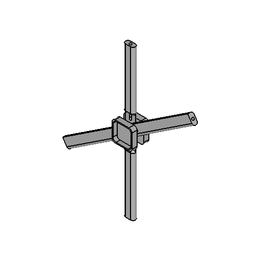 | 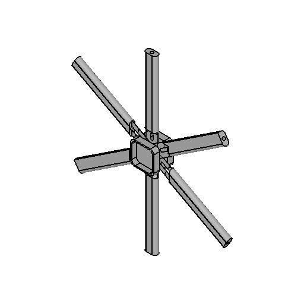 | 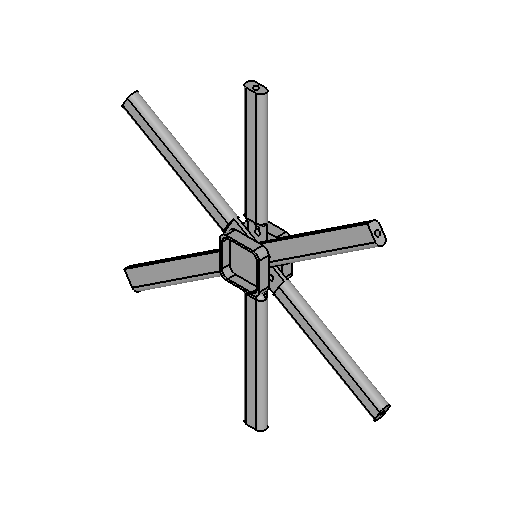 | 0.992 / 0.936 / 0.783 |
| **5. [hard]** Add a connecting hole of 1.7 millimetre diameter and apply 0.1 millimetre grooves to increase grip and prevent slipping.<br>`ZK22J6VYRKQ2RTFD_1758874422.1403751` | 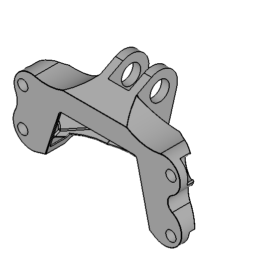 | 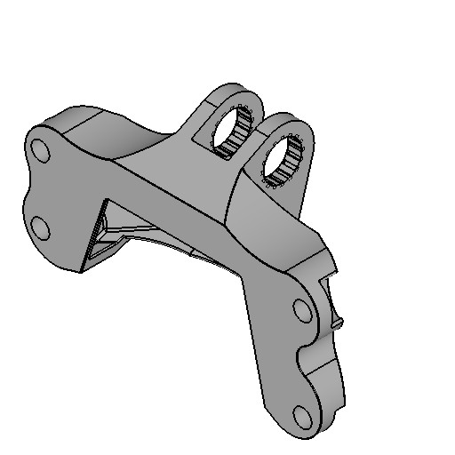 | 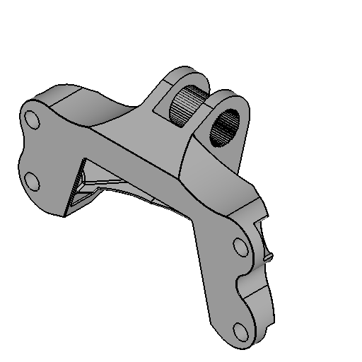 | 0.987 / 0.986 / 0.073 |

### Scores on the five test examples

| # | Request | Difficulty | Chamfer similarity | Volume F1 | Diff F1 |
|---|---|---|---|---|---|
| 1 | Gear teeth (`SUJ2G2UMJQR7PMBX_1759209987.785593`) | medium | 0.991 | 0.972 | 0.131 |
| 2 | Pin heads (`3YH2WFSRM22W7DKT_1769773335.525203`) | medium | 0.985 | 0.994 | 0.579 |
| 3 | Lever extension (`B7A2N74ZJBF9MZHU_1770174133.012106`) | easy | 0.985 | 1.000 | 0.797 |
| 4 | Third rotor blade (`F332D3FXML85WLR2_1769607142.566352`) | hard | 0.992 | 0.936 | 0.783 |
| 5 | Hole and grooves (`ZK22J6VYRKQ2RTFD_1758874422.1403751`) | hard | 0.987 | 0.986 | 0.073 |
| | **Mean over the five** | | **0.988** | **0.978** | **0.473** |

## Fire the dashboard

Everything lands in one Dash app: the method deck, any task's input and ground truth, our result next to the human's, per-task and whole-benchmark scores, saved run replays, and a tab with the five organiser-named test examples on one slide.

From the repo root, after the standard benchmark setup (`uv sync`, dataset extracted to `data/edit_192_external/`):

```bash
./submissions/UCONN-CAD-PACK/run_dashboard.sh
```

Then open http://127.0.0.1:8050. The launcher finds the repo root on its own, so it works from any working directory. If you cloned this folder as a standalone repository instead, point the launcher at your benchmark checkout:

```bash
NEURALCAD_REPO=/path/to/IDETC26-Hackathon-Autodesk-neuralCAD-Edit ./run_dashboard.sh
``` No API key is needed to browse; the key (see `src/.env.example`) is only needed if you want tab 4 to run the agent pipeline live.

To re-run the pipeline on a task, or re-score, from the repo root:

```bash
SUB=submissions/UCONN-CAD-PACK
# one task, then score it
PYTHONPATH="$(pwd):$SUB" .venv/bin/python -m src.pipeline \
    --request ZK22J6VYRKQ2RTFD_1758875163.609787 --score
# score everything produced so far
PYTHONPATH="$(pwd):$SUB" .venv/bin/python -m src.evaluate
```

## What is in this folder

```
UCONN-CAD-PACK/
├── README.md                  this file
├── run_dashboard.sh           fire the dashboard from here
├── src/         the pipeline: router, three agents, tool layer
│   └── results/               scores, saved dashboard runs,
│                              render cache, and the winning run record
│                              (scripts, logs, views) for each of the 48 tasks
├── tools/                     the dashboard and its helpers
├── docs/                      method write-up and architecture diagrams
├── outputs/                   one folder per request_id:
│   ├── ours.step              our edited B-rep
│   ├── ours.stl               our edited mesh (the file that was scored)
│   ├── gt.stl                 the human expert's edit (ground truth)
│   └── manifest.json          instruction, difficulty, scores per request
├── handoff/                   the exported run records: every task's plan,
│                              every candidate's CadQuery source, the verbatim
│                              executor prompts, and the selector study
├── figures/metric_bar_facets.png
├── presentation/UCONN_CAD_Pack.pdf
├── site/                      source for the GitHub Pages site — styles, the
│                              three.js viewer, the task index, and the GLB
│                              meshes the browser loads
└── scripts/                   rebuild the figure and the presentation
```

## The website

The site at [kiarash99naghavi.github.io/UCONN-CAD-PACK](https://kiarash99naghavi.github.io/UCONN-CAD-PACK/)
is built from what is already in this repository and deployed by
`.github/workflows/pages.yml` on every push to `main`.

```bash
python3 -m pip install markdown
python3 tools/build_site.py --serve      # http://localhost:8000
```

That is all CI runs. The two inputs it depends on are regenerated locally,
because they need OpenCASCADE and the licensed dataset:

```bash
export NEURALCAD_REPO=/path/to/IDETC26-Hackathon-Autodesk-neuralCAD-Edit
$NEURALCAD_REPO/.venv/bin/python tools/make_web_meshes.py   # site/assets/meshes
$NEURALCAD_REPO/.venv/bin/python tools/make_site_data.py    # index + thumbnails
```

`make_web_meshes.py` re-tessellates each part from its B-rep at a deflection
chosen for a browser viewport rather than for a voxel metric — 642 MB of scored
STL becomes 56 MB of GLB without decimating anything, because the geometry it
comes from is still exact.

The intermediate attempt geometry (about 2.5 GB per full sweep) is not included; the winning run records keep every attempt's script, log, and rendered views, so each edit is still auditable end to end.

## Data attribution

The `gt.stl` files under `outputs/` are the human expert edits from the neuralCAD-Edit dataset (CC BY-NC 4.0), included here for side-by-side comparison with our outputs. The benchmark creators confirmed it is OK to include these ground truth files in the submission. All credit for the dataset and ground truth edits goes to them:

```bibtex
@inproceedings{perrett2026neuralcadedit,
  title={neuralCAD-Edit: An Expert Benchmark for Multimodal-Instructed 3D CAD Model Editing},
  author={Perrett, Toby and Bouchard, Matthew and McCarthy, William},
  booktitle={arXiv preprint arXiv:2604.16170},
  year={2026}
}
```
